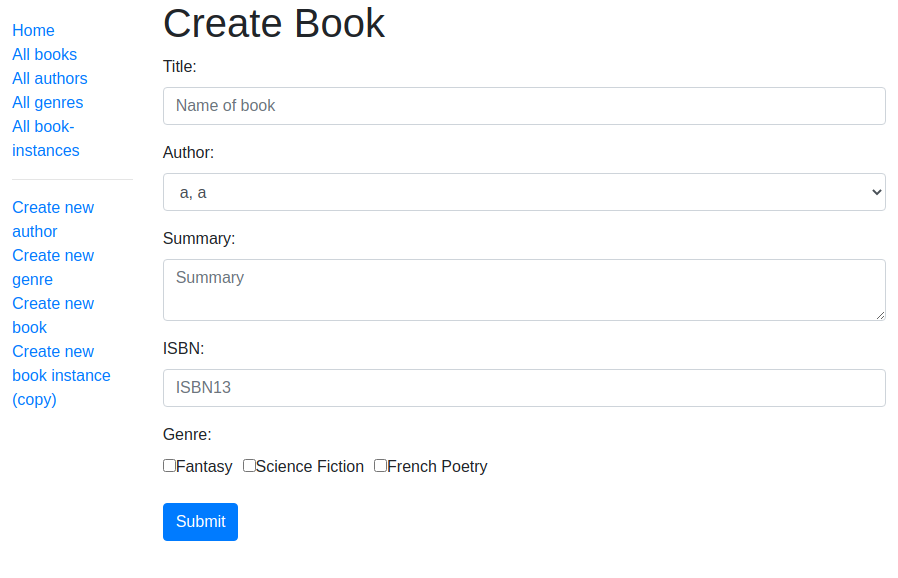

**Objective**

The local library project uses Node.js, Express/Express Package, Pug, Cookie Parser, Debug, Morgan, HTTP-Errors, Mongoose, MongoDB, Bootstrap, Luxon to create a full stack application. 

***Images/Features***

Homepage: 

The homepage features several links on the left sidebar, the title, and dynamic content that counts Books, Copies, Copies Available, Authors, and Genres.

All Books:

The All Books link routes to a Book List that shows all available books in the database.

Book Page: 

When a user clicks on a book they are routed to the book description page. On this page the user will see all copies of the book available and the status for each copy. The book page also has a link to the delete and update book forms.

Delete Book: 

From the delete book page users can delete any book from the database they choose. After deleting a book users are routed back to the Book List page.

Update Book:

When a user clicks the update book link it will route to a form where they can make the desired changes then submit the form. The user will be routed back to the book page after submitting. 

All Authors: 

The all authors link pulls up a list of authors in the database. From this list users can select which author they would like to view.

Author Page:

When viewing the author page users will see a date of birth/death (if listed in the database), books the author has written, a delete author link, and an update author link.

Delete Author:

When clicking the delete author link the user will be prompted to delete the books the author currently has on file before deleting the author. If the user chooses to delete the books they will then have a delete author option.

Update Author:

When the user clicks the update author button they will see a form that has the authors information, if in the database, already populated. The user can adjust the information or add additional information in the input fields. After updating the user clicks submit and is routed back to the author's page.

All Genres Page: 

The all genres link will route the user to the genre list page. The user can click a genre to view more information about it.

Genre Page: 

When the user clicks a genre they are routed to a page that shows the books the database has listed with that genre. There are delete and update genre links on this page also.

Delete Genre: 

If the user selects the delete genre link they are asked if they'd like to delete the genre, if they choose they can click delete and will be routed back the the genre list afterwards.

Update Genre:

The user can update the genre if they choose. The genre they accessed the update link on will populate in the form input field for their updates. Once the update is made the user will click submit and be routed to the updated genre list.

All Book Instances:

When users click the all book instance link they are taken to a list of all book instances the database has. The user can click an instance for more information.

Book Instance:

After clicking on a book instance, users will see the book id, name, imprint, status, and links to delete or update the book instance.

Delete Book Instance:

The delete book instance link will take users to a page that shows the book instance details and asks for confirmation of the delete. Once user click delete they will be routed back to the updated book instance list.

Update Book Instance:

The update book instance link will take users to a form that has the book instance information populated. The user will update the instance and submit to be routed the the updated book instance list.

Create New Author:

The create author link on the left sidebar lets the user enter the form data and submit. Once the form is submitted the user is routed back to the newly created author's page so the entry can be proofread.

Create New Genre:

The create genre link takes users to a form that they can use to create whatever genre they would like to be able to attach to book entries. The new genre will be visible on the create book form.

Create New Book:

The create book link will route users to the create book form where they can add new information and submit to add a new book to the all books page.

Create New Book Instance:

The create book instance form is used when the book is already in the database but a new copy is created. The book is a drop down menu so only books in database can have a new instance created. Users wishing to enter a book not on the list must first input the book in the New Book form. Once the book instance is created the user hits submit.

***Credits***
This project was created with guidance from an mdn tutorial.